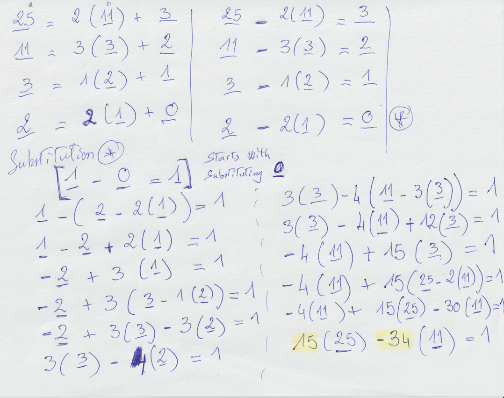
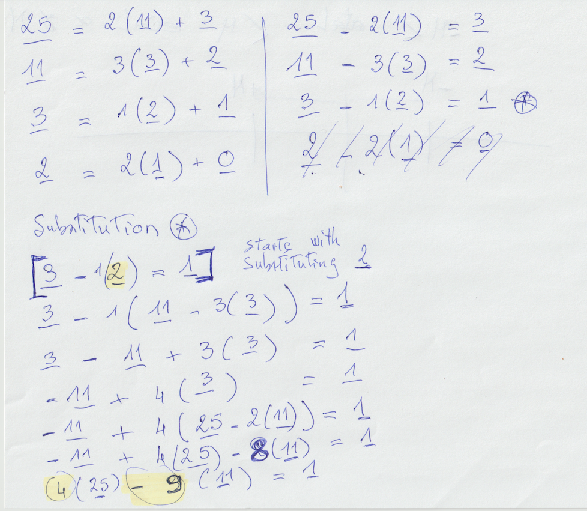

# Extended Euclid Comments

### `Example p. 22:` To compute gcd(25, 11), Extended Euclid's algorithm: 

:one: Using the [mindless algorithm](https://www.youtube.com/watch?v=6KmhCKxFWOs&feature=youtu.be&t=286), we would proceed as follows: 

:bulb: This is how the `book` resolves the algorithm



:warning: This is how the Pseudo Algorithm [Figure 1.6](scala/src/main/scala/chapter1/Figure_1_6.scala) resolves the algorithm

```
The substitution starts with (_2) and (_0) is ignored
```



### References:

| Link                                        | Comments                                           | Author           |
|---------------------------------------------|----------------------------------------------------|------------------|
| https://youtu.be/6KmhCKxFWOs?t=536          | `Big Rule`: Treat underlined numbers like variables| John Bowers      |
