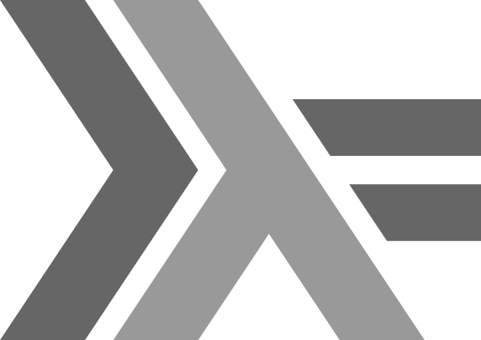

# Comparison

#### :m: Compare Haskell vs Scala REPL `based on `[LYAH book](http://learnyouahaskell.com/)

[Version](Version.md)

#### :m: API

| Data Structure  | Description                                                                          | Comments |
|-----------------|--------------------------------------------------------------------------------------|----------|
| [List](List.md) | [List (abstract data type)](https://en.wikipedia.org/wiki/List_(abstract_data_type)) |          |
| [Range](Range.md) | [Set Builder Notation](https://en.wikipedia.org/wiki/Set-builder_notation) |  Set, For   |
| [Comprehension](Comprehension.md) | [Set Builder Notation](https://en.wikipedia.org/wiki/Set-builder_notation) |  Set, For         |

### Functional Programming Concepts 

|  operator   | Type Class  |  Type Definition                                 | function | Comments        |
|:-------:|-------------|------------------------------------------------------|----------|-----------------|
| `.`     | Compose     | `(.) :: (b -> c) -> (a -> b) -> a -> c`              |          |                 |
| `<>`    | Semigroup   | `(<>) :: Semigroup a => a -> a -> a`                 |          |                 |
| `<$>`   | [Functor](https://wiki.haskell.org/Typeclassopedia#Functor)        | `(<$>) :: Functor f => (a -> b) -> f a -> f b`       | fmap     |                 |
| `<*>`   | [Applicative](https://wiki.haskell.org/Typeclassopedia#Applicative)| `(<*>) :: Applicative f => f (a -> b) -> f a -> f b` |          | pronounce `app` |
| `=<<`   | [Monad](https://wiki.haskell.org/Typeclassopedia#Monad)            | `(=<<) :: Monad m => (a -> m b) -> m a -> m b`       |          |         |
| `>>=`   |             | `(>>=) :: Monad m => m a -> (a -> m b) -> m b`       |          |         |

